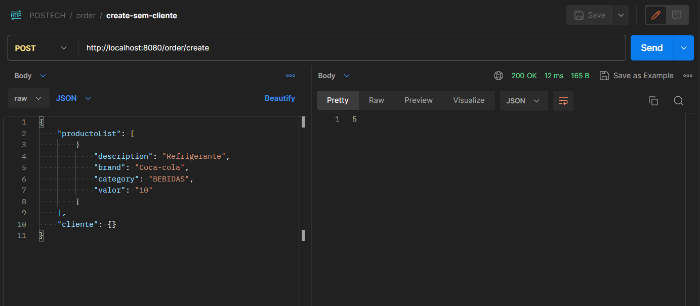
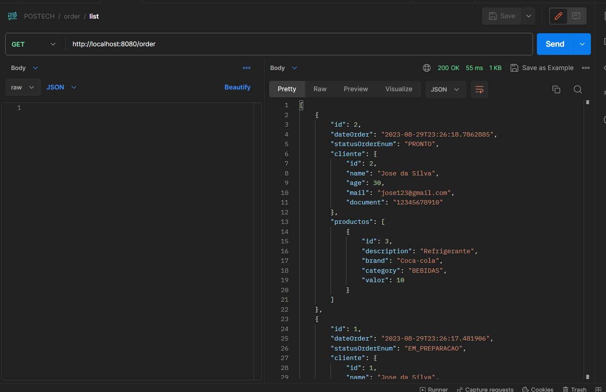
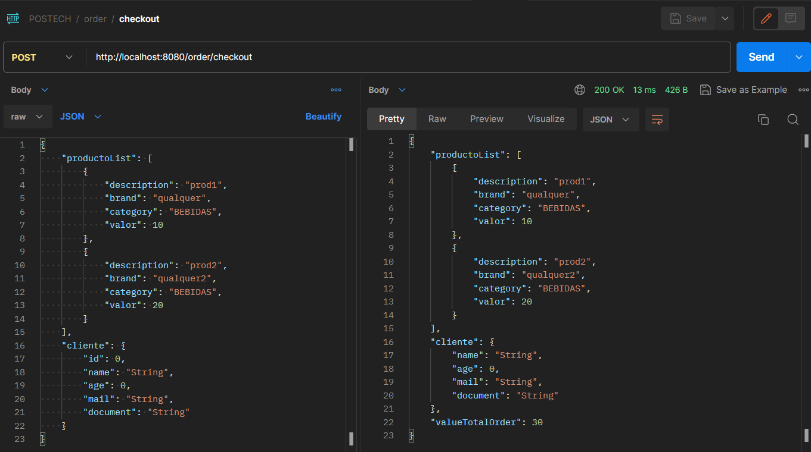

# Challenger POS-TECH 

## 💻 Projeto
Projeto para desenvolvimento de sistema de fast food, para apoio a uma lanchonete de baiiro que está expandindo suas operacoes devido seu grande sucesso. 

Entrega parte 1 (APIs):
  ```sh
* Cadastro de cliente
  * Identificação via cpf
* Crud Produtos
* Buscar produto por categoria
* Fake checkout 
* Lista de pedidos 
  ```

Entrega parte 2 (APIs e Infraestrutura):
  ```sh
* Configuração de infra escalável e orquestrada com k8s
* Refatoração da app, aplicando conceitos de Clean Architecture
  * Checkout pedidos 
  * Atualização de status pedido (RECEBIDO, EM_PREPARACAO, PRONTO)
  * Listagem de pedidos de forma ordenada (data_chegada e status_pedido)
  ```

## 🔖 Infraestrutura

### Built With

* Java 8+
* Maven 3.3+ 
* Docker

### Prerequisites

* docker
  ```sh
  sudo apt-get install docker.io
  ```
* docker-compose
  ```sh
  sudo apt-get install docker-compose
  ```

### Installation

1. Clone the repo
   ```sh
   git clone https://github.com/belo355/java-challenger-food-fiap.git
   ```
2. Build docker images
   ```sh
   docker-compose build --no-cache --pull
   ```
3. Run docker app
   ```sh
   docker-compose up
   ```
4. (Optional) for windows maybe need to add this command before RUN ./mvnw into dockerfile :
   ```sh
   RUN dos2unix mvnw
   ```


## 🚀 Vamos  Começar 

Abaixo segue configurações locais e exemplos de apis entregues nas partes 1 e 2 

### API Especification - 👀 Tea with my! 
 ```sh
http://localhost:8080/swagger-ui/index.html
 ```

### Application 👋 Les't code !

- [x] Identificação de cliente 
 ```sh
   curl --location 'http://localhost:8080/cliente/registre' \
--header 'Content-Type: application/json' \
--data-raw '{
    "name":"Jose da Silva",
    "age": "30", 
    "mail": "jose123@gmail.com",
    "document": "12345678910"
}'
   ```


- [x] Criação de pedidos 
  - Para criação do pedido nao fica obrigatorio o uso da estrutura de clientes, exemplo a seguir: 
 ```sh
curl --location 'http://localhost:8080/order/create' \
--header 'Content-Type: application/json' \
--data-raw '{
    "productoList": [
        {
            "description": "Refirgerante",
            "brand": "Coca-cola",
            "category": "BEBIDAS",
            "valor": "10"
        }
    ],
    "cliente": {
        "id": 1,
        "name": "Jose da Silva",
        "age": 30,
        "mail": "jose123@gmail.com",
        "document": "12345678910"
    }
}'
   ```


-- criação de pedido sem cliente
 ```sh
curl --location 'http://localhost:8080/order/create' \
--header 'Content-Type: application/json' \
--data-raw '{
    "productoList": [
        {
            "description": "Refirgerante",
            "brand": "Coca-cola",
            "category": "BEBIDAS",
            "valor": "10"
        }
    ],
    "cliente": {}
}'
   ```


- [x] Listagem de pedidos
  - a listagem de pedidos é retornada de forma ordenada, sendo os parametros de ordem (data de chegada e status do pedido)
 ```sh
curl --location 'http://localhost:8080/order' \
--data ''
   ```



- [x] Fake Checkout
  - retorna o resumo de produtos listados, e total geral previo do pedido. 
 ```sh
curl --location 'http://localhost:8080/order/checkout' \
--header 'Content-Type: application/json' \
--data '{
    "productoList": [
        {
            "description": "prod1",
            "brand": "qualquer",
            "category": "BEBIDAS",
            "valor": 10
        },
        {
            "description": "prod2",
            "brand": "qualquer2",
            "category": "BEBIDAS",
            "valor": 20
        }
    ],
    "cliente": {
        "id": 0,
        "name": "String",
        "age": 0,
        "mail": "String",
        "document": "String"
    }
}'
   ```

